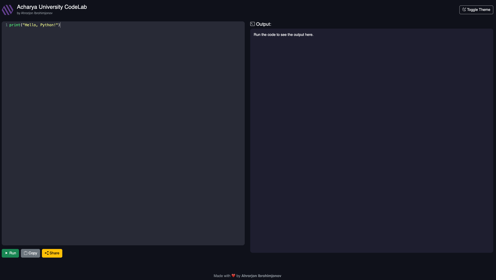

# Acharya University Python Code Lab 🧪🐍

Welcome to the official repository for the **Acharya University Digital Code Lab** – an interactive web-based Python coding lab built with Flask and CodeMirror. It is designed to help students write, run, share, and even **take styled screenshots** of their Python code in a beautiful IDE-like environment.

---

## ✨ Features

* ✅ Real-time Python code execution with support for `input()`
* 💡 Autocomplete and syntax highlighting (CodeMirror + Dracula theme)
* 📋 Copy code to clipboard
* 📤 Share code via unique links
* 📸 Capture IDE-style **screenshots** with:

  * Title: "Acharya University Digital Code Lab"
  * Timestamp (date and time)
  * Footer: "Powered by Ahrorjon"
  * Highlighted code inside a styled frame
* 🌗 Light/Dark theme toggle

---

## 🧰 Tech Stack

* **Frontend**:

  * HTML5, CSS3 (Bootstrap 5)
  * JavaScript (CodeMirror for editor)
  * dom-to-image (for screenshot capture)

* **Backend**:

  * Python 3
  * Flask (REST API for code execution and sharing)
  * subprocess with sandboxing for secure code running

---

## 🚀 Getting Started

### 1. Clone the Repo

```bash
git clone https://github.com/YourUsername/acharya-python-lab.git
cd acharya-python-lab
```

### 2. Set Up a Virtual Environment

```bash
python -m venv venv
source venv/bin/activate  # On Windows: venv\Scripts\activate
```

### 3. Install Requirements

```bash
pip install -r requirements.txt
```

### 4. Run the App

```bash
flask run
```

Visit: `http://localhost:5000`

---

## 📂 Project Structure

```
acharya-python-lab/
├── static/
│   ├── css/
│   ├── js/
│   └── logo.png
├── templates/
│   └── python_lab.html
├── app.py
├── requirements.txt
└── README.md
```

---

## 📸 Screenshot Sample



---

## 📜 License

This project is licensed under the MIT License.

---

## 🙏 Credits

Made with ❤️ by **Ahrorjon Ibrohimjonov** for Acharya University Students.

---

## 🔗 Connect

* GitHub: [@axrorback](https://github.com/axrorback)
* Telegram: [@axrorback](https://t.me/axrorback)

---

Enjoy coding 🧠💻!
